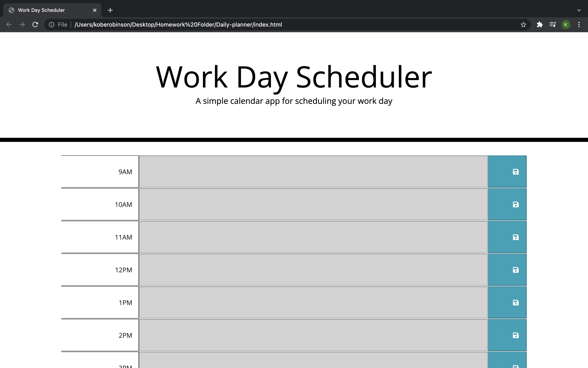

# Daily-planner

## Overview
This assignment was given to us to help us understand more about time and localstorage in javascript. After this assignment I am more comfortable with how to use time inside of javascript

My motivation for this assignment was trying to better my self and using my time more wisely through the day.

I created this assignment because I am constantly finding my self putting things till the last minute so making a daily planner helps so much with that.

I learned more so about local storage and how to better use time inside of javascript.

## Installation
Installation is very easy. To type inside of the timeblocks just click the individual block and then to save click the blue button on the right hand side.

## The Quiz

## Links
link to the Daily-Planner: https://koberobinson.github.io/Daily-planner/

Link to the Github: https://github.com/koberobinson/Daily-planner

## License
MIT License

Copyright (c) [2021] [Kobe Robinson]

Permission is hereby granted, free of charge, to any person obtaining a copy
of this software and associated documentation files (the "Software"), to deal
in the Software without restriction, including without limitation the rights
to use, copy, modify, merge, publish, distribute, sublicense, and/or sell
copies of the Software, and to permit persons to whom the Software is
furnished to do so, subject to the following conditions:

The above copyright notice and this permission notice shall be included in all
copies or substantial portions of the Software.

THE SOFTWARE IS PROVIDED "AS IS", WITHOUT WARRANTY OF ANY KIND, EXPRESS OR
IMPLIED, INCLUDING BUT NOT LIMITED TO THE WARRANTIES OF MERCHANTABILITY,
FITNESS FOR A PARTICULAR PURPOSE AND NONINFRINGEMENT. IN NO EVENT SHALL THE
AUTHORS OR COPYRIGHT HOLDERS BE LIABLE FOR ANY CLAIM, DAMAGES OR OTHER
LIABILITY, WHETHER IN AN ACTION OF CONTRACT, TORT OR OTHERWISE, ARISING FROM,
OUT OF OR IN CONNECTION WITH THE SOFTWARE OR THE USE OR OTHER DEALINGS IN THE
SOFTWARE.